# NANUALUK Expédition Nordique
## Une glace fragile fait par : GSM Studios

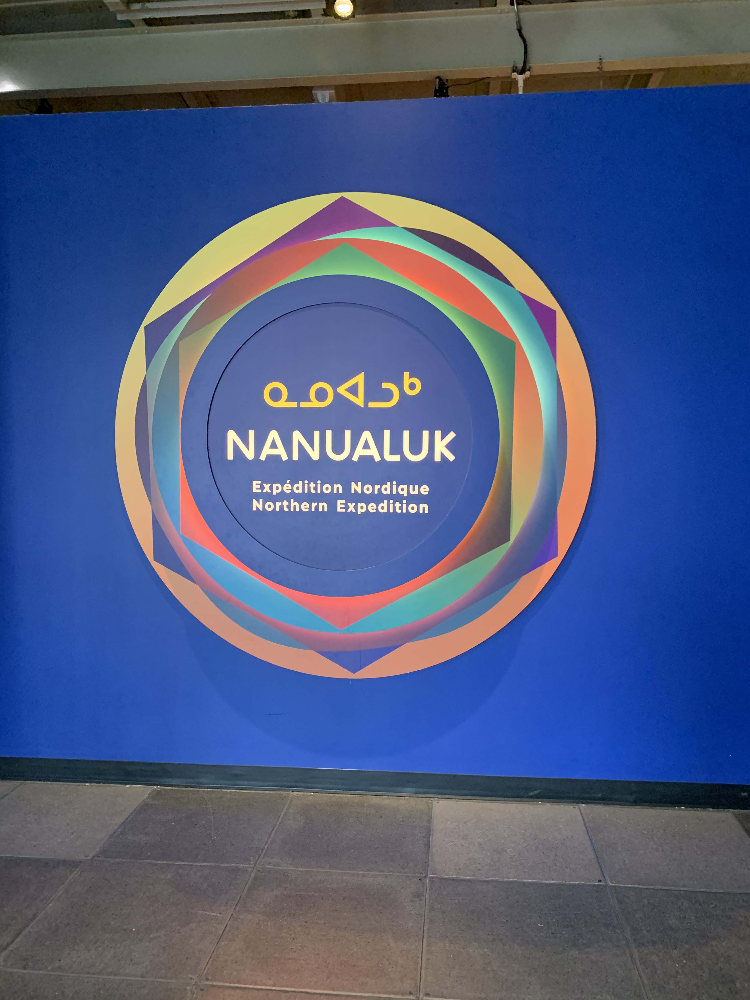
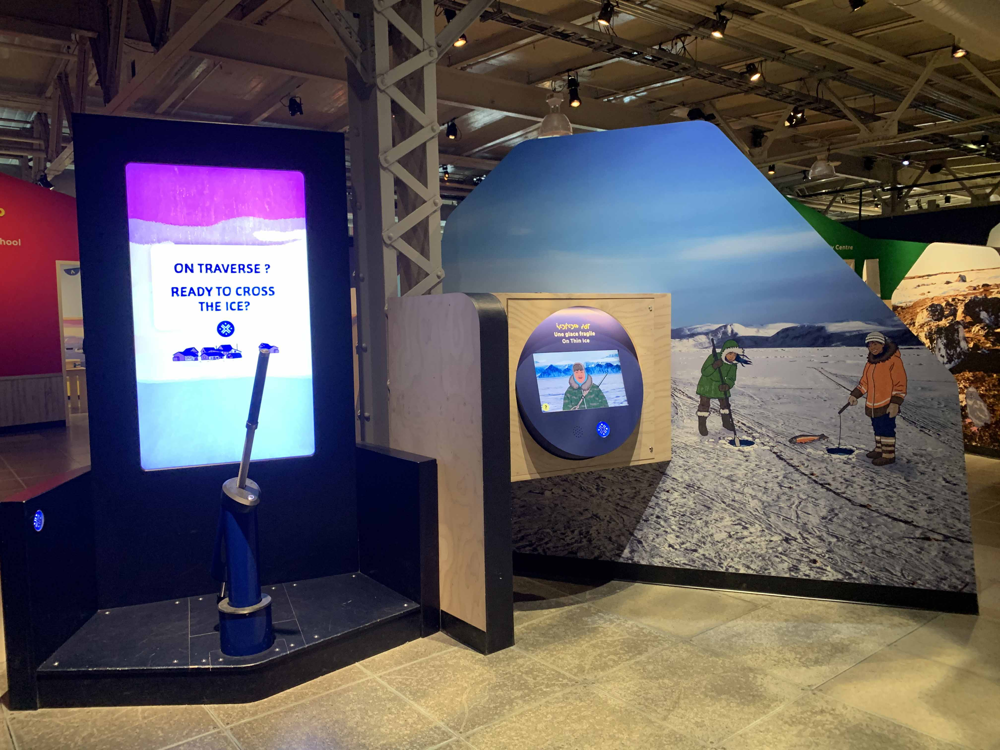

> Affiche de l'exposition - Jayden Louis

> Vue d'ensemble du dispositif - Jayden Louis

## Lieu de mise en exposition
Au Centre des sciences de Montréal

## Type d'exposition
Permanente

## Date de ma visite
1er Avril 2026

## Année de réalisation
2025

## Description de l'oeuvre
Pour jouer : 1 : Utilise ton nanuuo tuminga pour débuter une mission. 2 : Explore toute la salle pour accomplir ta mission. 3 : Reviens voir le personnage pour vérifier si tu as bien rempli ta mission. 4 : Collecte ta récompense !

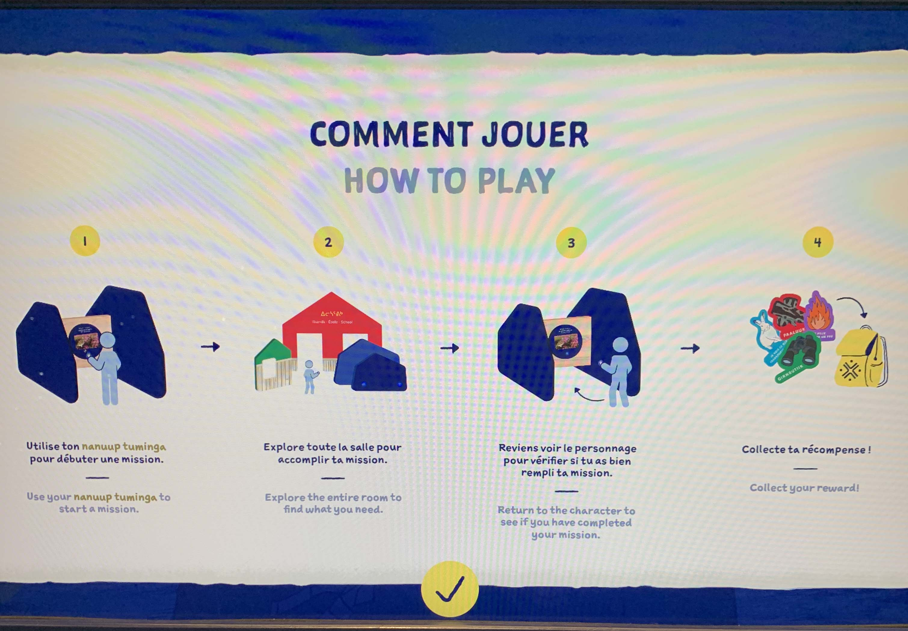
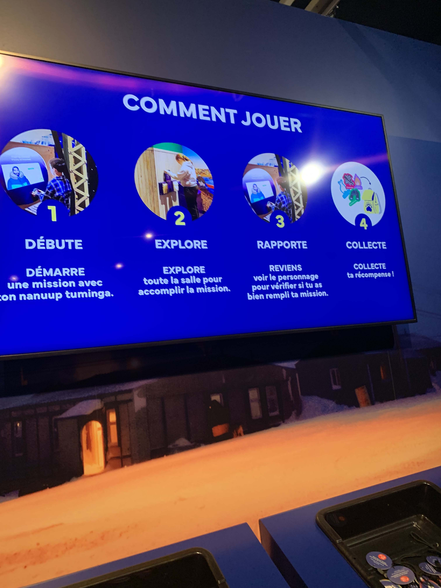

## Type d'installation
Interactive

## Fonction du dispositif multimédia
Pour commencer, le but de l'exposition est de faire plein de tâches à accomplir pour accumuler des trophés. Pour savoir quels dispositifs ont été utilisé, il faut scanner son "nanuup tuminga" sur le dispositif. Toutes les données des tâches réussit sont sauvegardés sur le nanuup tuminga. Dans le dispositif que j'ai utilisé, il faut rentrer dans son village avant la tombée de la nuit. Mais le problème est qu'il y a de la glace devant soi et il faut vérifier si la glace est assez solide pour traverser. Pour faire cela, il faut pousser le harpon vers la glace 3 fois et si la glace rest intacte, on peut traverser mais si elle casse, il faut bouger le harpon vers une autre direction et réessayer la même chose. Il y aussi des obstacles qui rendent la tâche plus difficile comme un ours polaire qui bloque le chemin ou une tempête de neige qui rend les choses difficiles à voir. Quand la mission est réussie, on ressoit un message de félicitation et il faut juste scanner son nanuup tuminga sur le dispositif à côté pour sauvegarder son progrès.

## Mise en espace

## Composante, techniques et éléments nécéssaires
Deux écrans. Un pour le jeu et l'autre pour montrer les consignes. Le harpon mécanique, le bouton sur le harpon aussi. Le scanner pour le nanuup tuminga et les haut parleurs. Il y a aussi les lumières.

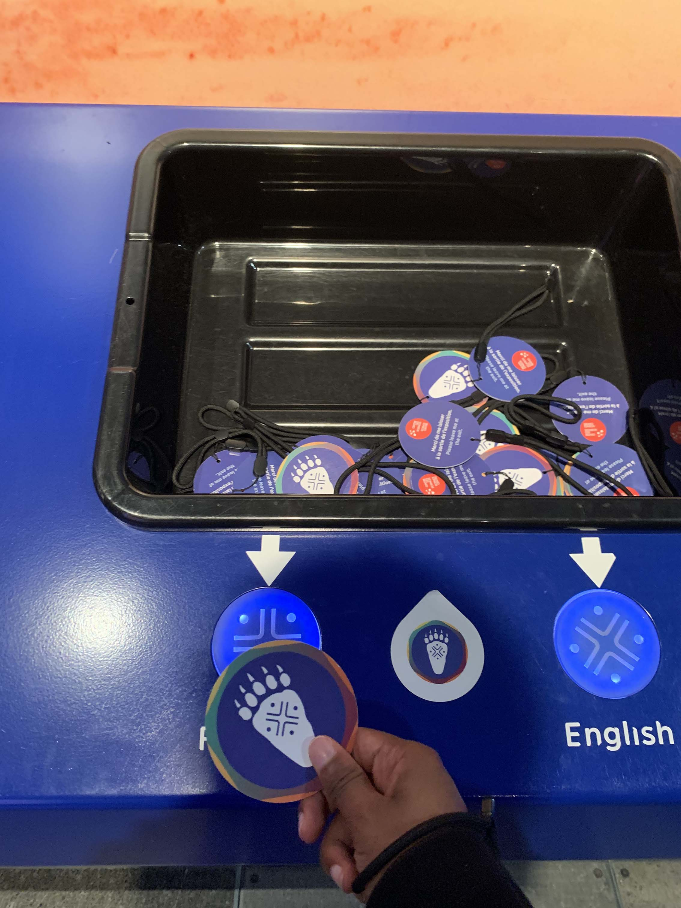
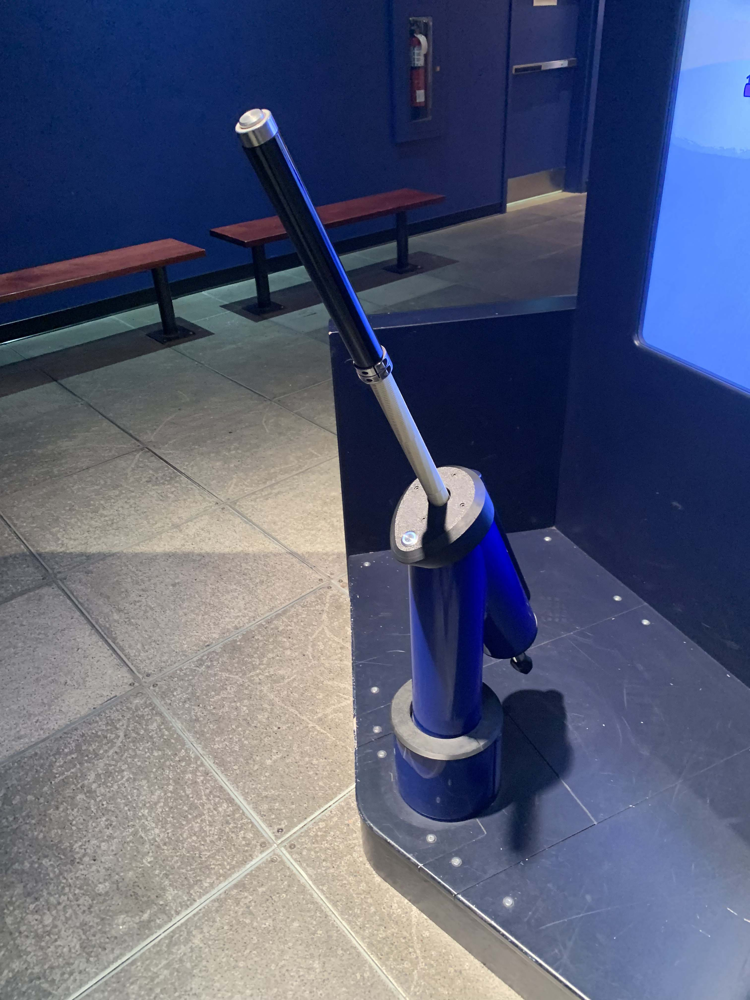

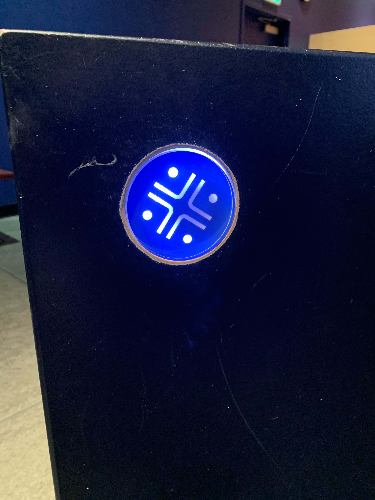
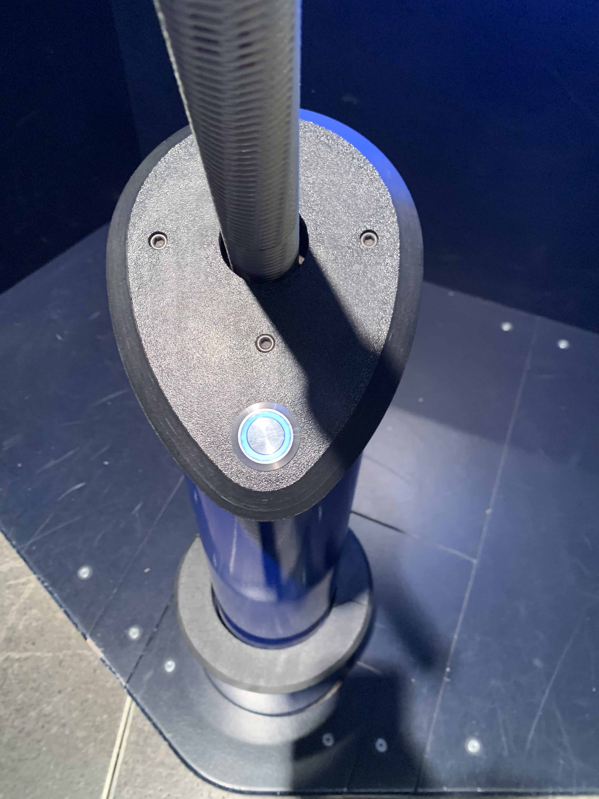
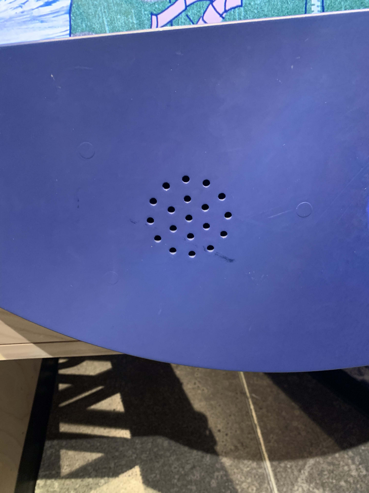
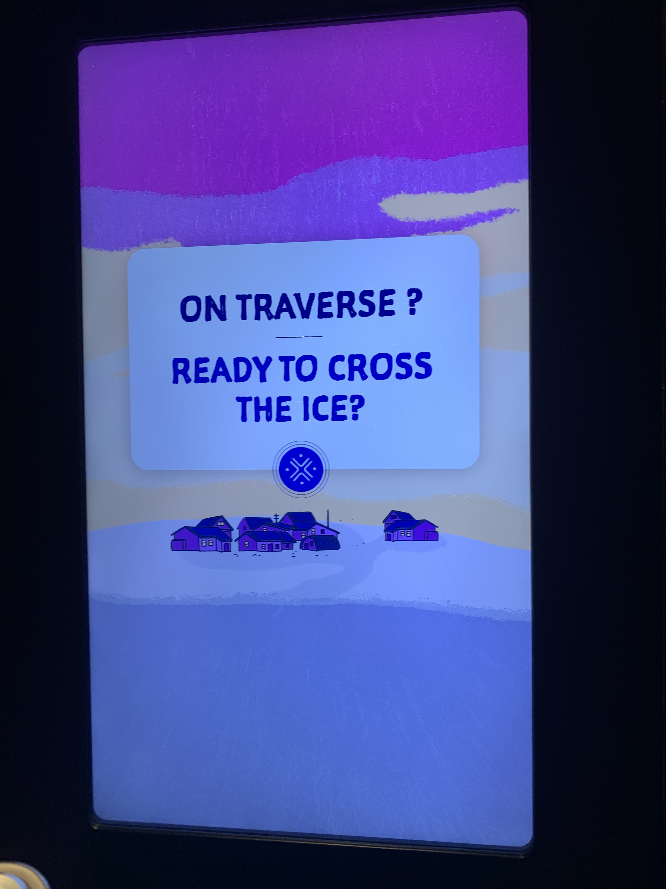
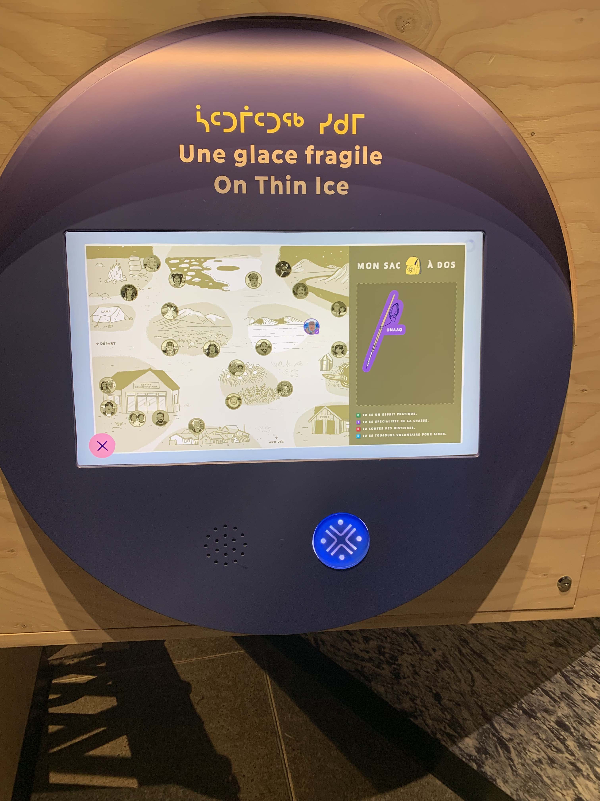

## Éxpérience vécue

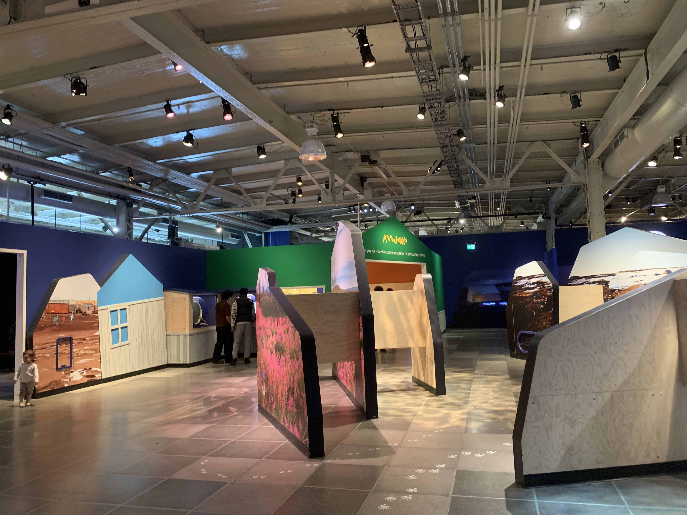

J'entre dans l'exposition et je vois un grand écran qui explique comment utiliser les dispositifs. En continuant tout droit, on peut voir des petites cartes qui s'appellent des nanuup tuminga et on doit les scanner sur un scanner pour choisir la langue. Il y en avait un en français et l'autre était en anglais. J'ai choisi français.
 Ensuite, je vois un dispositif qui s'appelle "Une glace fragile". Je scanne mon nanuup tuminga et un personnage m'explique ce qu'il faut faire. Il me de dit que je dois traverser la glace pour atteindre mon village. À la gauche de se dispositif, il y en avait un autre qui était directement lié à celui-ci. Ce dispositif présente un harpon qui peut se faire pousser vers le bas et se pivoter aussi. 

 ## Ce qui m'a plu et donné des idées
 J'ai aimé que le nanuup tuminga est un moyen de sauvegarder son progrès à travers chaque dispositifs. J'ai aussi apprécié le dispositif en tant que tel, je m'étais bien amusé à vérifier si la glace allait se briser devant moi. Utiliser un controlleur qui à la forme d'un harpon était une très bonne idée. C'était immersif.

 ## Ce que je ferais autrement
 J'augmenterais la difficulté du jeu parce qu'il était quand même facile à réussir. J'ajouterais plus d'ours polaire qui bloquent le chemin mais je ferais qu'ils attaquent si on ne réagit pas assez rapidement.
