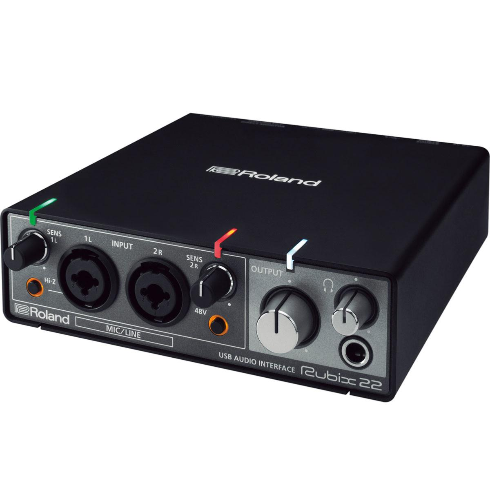
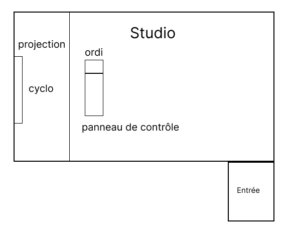
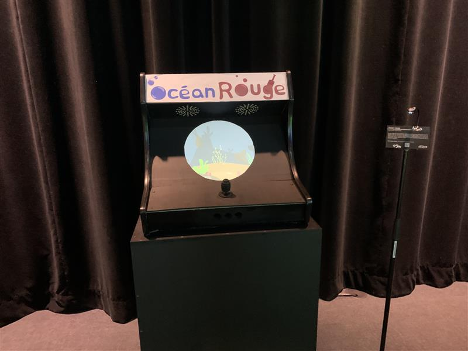

# Terminal
|:pencil2: Information recherchée  | :camera: Appui visuel à intégrer | Détails supplémentaires |
| ---     | ---             | --- |
| No ordre de préférence | |1 |
| Titre du projet ||Terminal |
| Noms des créateurs et créatrices||Émeryk Bélisle, Elie Daher, Ting Yung Lu Terry, Dana Saavedra-Torrano et Mégane Ranger|
| Installation en cours (ou finale)||Il y a 6 poufs pour que les joueurs s'assoient dessus. Devant les joueurs il y a la projection qui montre le jeu terminal. À droite de la projection il y a un code qr qu'il faut scanner pour entrer dans le jeu. |
| Schéma de l'installation prévue| |Source : https://pythons-5.github.io/Terminal/#/technique/ Nom du fichier : schema_terminal.png|
| Ce que vous ressentez en expérimentant chacune des installations, avec justification (avant/après l'expérimentation)||Avant: Je ne savais pas vraiment à quoi m'attendre mais j'étais tout de même intéressé à essayer ce jeu collaboratif. Après : J'ai trouvé l'oeuvre intéressante je me suis bien amusé à la joeur avec des amis. C'est un jeu simple, mais très bon. |

En pensant à votre cheminement dans la formation en TIM

  **Indiquer les informations suivantes:**
  
  |:pencil2: Information recherchée  | :camera: Appui visuel à intégrer | Détails supplémentaires |
  | ---     | ---             | --- |
  |  Nommer 3 cours du programme qui vous semblent incontournables pour avoir les compétences pour créer ce genre de projet (voir la [grille de cours du programme](https://www.cmontmorency.qc.ca/programmes/nos-programmes-detudes/techniques/techniques-dintegration-multimedia/grille-de-cours/)) ||Interactivité ludique, Audio et Installation multimédia |
  | Nommer et décrire une technique **ou** une composante technologique qui est utilisée dans l'**un des projets** et que vous ne connaissiez pas. ||Le câble XLR est utilisé pour transmettre l'audio de façon équilibrée. Source : https://soundscapehq.com/fr/quest-ce-quun-cable-xlr/|

# Symbiose
|:pencil2: Information recherchée  | :camera: Appui visuel à intégrer | Détails supplémentaires |
| ---     | ---             | --- |
| No ordre de préférence ||2 |
| Titre du projet ||Symbiose |
| Noms des créateurs et créatrices||Yannick Chamberland, Benjamin Ferland, Ryan Dufault et Walid Cheour. |
| Installation en cours (ou finale)| Source : https://les-chimistes.github.io/symbiose/#/presse/|Il y a une table avec 4 dispositifs dessus. Étant donné que c'est un jeu à quatre, chacun des joueurs doivent controller un dispositif chacun. Devant la table, il y a la projection pour que les joueurs voient leurs progrès.  |
| Schéma de l'installation prévue| |Source : https://les-chimistes.github.io/symbiose/#/technique/ Nom du fichier : photos/schema_symbiose.webp|
| Ce que vous ressentez en expérimentant chacune des installations, avec justification (avant/après l'expérimentation)||Avant : Cette installation ne m'intéressait pas tant que ça je ne m'attendais pas à quelque chose de très amusant. Après : Je suis vraiment content que cette installation m'a prouvé le contraire des idées que je m'étais fait. C'est vraiment amusant comme installaton et elle nécéssite le travail d'équipe. |

En pensant à votre cheminement dans la formation en TIM

  **Indiquer les informations suivantes:**
  
  |:pencil2: Information recherchée  | :camera: Appui visuel à intégrer | Détails supplémentaires |
  | ---     | ---             | --- |
  |  Nommer 3 cours du programme qui vous semblent incontournables pour avoir les compétences pour créer ce genre de projet (voir la [grille de cours du programme](https://www.cmontmorency.qc.ca/programmes/nos-programmes-detudes/techniques/techniques-dintegration-multimedia/grille-de-cours/)) |Animation 2D, Illustration numérique et Audio| |
  | Nommer et décrire une technique **ou** une composante technologique qui est utilisée dans l'**un des projets** et que vous ne connaissiez pas. ||La composante technologique que je ne connaissais pas est la carte de son multi-sorties. Elle set à enregistrer et convertir les signaux audio analogiques en signaux numériques. Source : https://commentouvrir.com/tech/le-role-de-la-carte-son-tout-savoir-sur-cet-element-incontournable/|

  # Mission décollage
 |:pencil2: Information recherchée  | :camera: Appui visuel à intégrer | Détails supplémentaires |
| ---     | ---             | --- |
| No ordre de préférence ||3|
| Titre du projet ||Mission décollage |
| Noms des créateurs et créatrices||Ahmed Kaissoumi, Radhouane Kordan, Justin Montpetit, Thearylou Lach et Jad Saloumi |
| Installation en cours (ou finale)|photo de l'ensemble de l'installation dans le studio|Il y a un panneau de contrôle pour piloter le vaisseau et la projection est devant le joueur. Sur le panneau de contrôle, il y a des boutons pour contrôller le vaisseau. Il y a des boutons ppour changer la vitesse, se déplacer à gauche et à droite, un bouton pour mettre un bouclier sur le vaisseau, etc. |
| Schéma de l'installation prévue| |Source : https://o-i-g-n-o-n.github.io/Mission-decollage/#/technique/ Nom du fichier : schema_mission.png|
| Ce que vous ressentez en expérimentant chacune des installations, avec justification (avant/après l'expérimentation)||Avant, j'étais tout de même intéressé par le projet, je voulais voir de quoi il s'agissait. Après, j'ai bien aimé l'expérience c'est juste que j'ai trouvé difficile de réussir la mission, étant donné que j'ai essayé de le faire seul même si c'est un jeu qui doit être joué d'équipe. |

En pensant à votre cheminement dans la formation en TIM

  **Indiquer les informations suivantes:**
  
  |:pencil2: Information recherchée  | :camera: Appui visuel à intégrer | Détails supplémentaires |
  | ---     | ---             | --- |
  |  Nommer 3 cours du programme qui vous semblent incontournables pour avoir les compétences pour créer ce genre de projet (voir la [grille de cours du programme](https://www.cmontmorency.qc.ca/programmes/nos-programmes-detudes/techniques/techniques-dintegration-multimedia/grille-de-cours/)) ||Audio, illustration numérique et modélisation 3D |
  | Nommer et décrire une technique **ou** une composante technologique qui est utilisée dans l'**un des projets** et que vous ne connaissiez pas. |photo ou croquis de la technique ou composante|Je ne connaissait pas le contrôleur Arduino M5Stack ATOM Lite ESP32. Il est utilisé pour les projets nécessitant un contrôleur embarqué fiable et flexible. Source : https://fr.manuals.plus/m5stack/atom-s3u-programmable-controller-manual |

 # Océan rouge
 |:pencil2: Information recherchée  | :camera: Appui visuel à intégrer | Détails supplémentaires |
| ---     | ---             | --- |
| No ordre de préférence || 4|
| Titre du projet ||Océan rouge |
| Noms des créateurs et créatrices||Amira Tounekti et Kristy Moussally |
| Installation en cours (ou finale)|| |
| Schéma de l'installation prévue| schéma de mise en espace (*plantation* ou *implantation*)||
| Ce que vous ressentez en expérimentant chacune des installations, avec justification (avant/après l'expérimentation)|| |

En pensant à votre cheminement dans la formation en TIM

  **Indiquer les informations suivantes:**
  
  |:pencil2: Information recherchée  | :camera: Appui visuel à intégrer | Détails supplémentaires |
  | ---     | ---             | --- |
  |  Nommer 3 cours du programme qui vous semblent incontournables pour avoir les compétences pour créer ce genre de projet (voir la [grille de cours du programme](https://www.cmontmorency.qc.ca/programmes/nos-programmes-detudes/techniques/techniques-dintegration-multimedia/grille-de-cours/)) || |
  | Nommer et décrire une technique **ou** une composante technologique qui est utilisée dans l'**un des projets** et que vous ne connaissiez pas. |photo ou croquis de la technique ou composante|Indiquer la source de l'information pour cette recherche |
