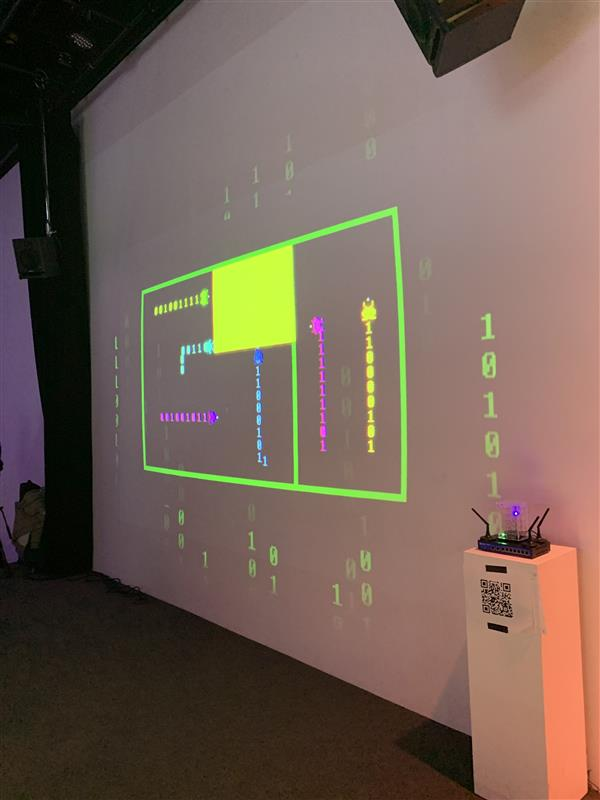
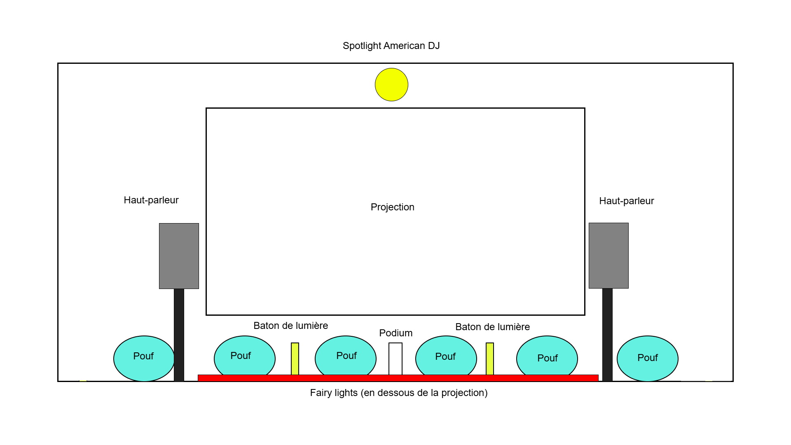
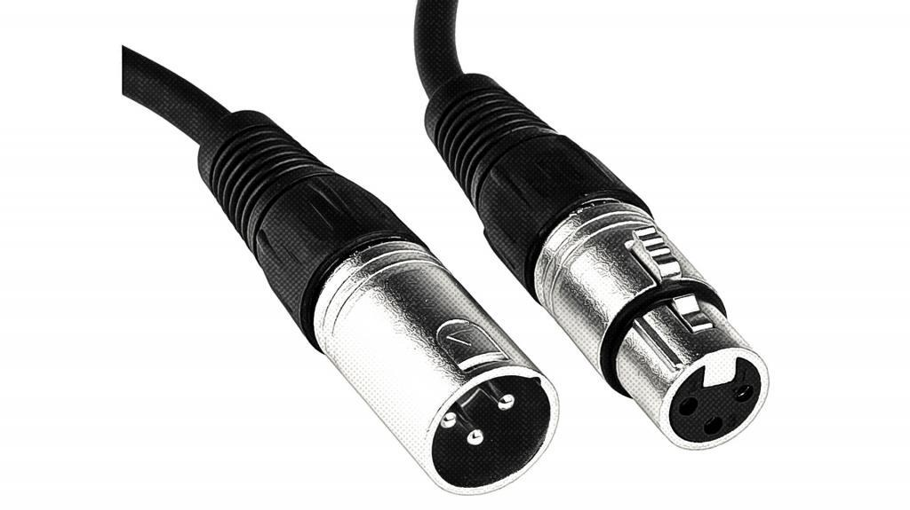
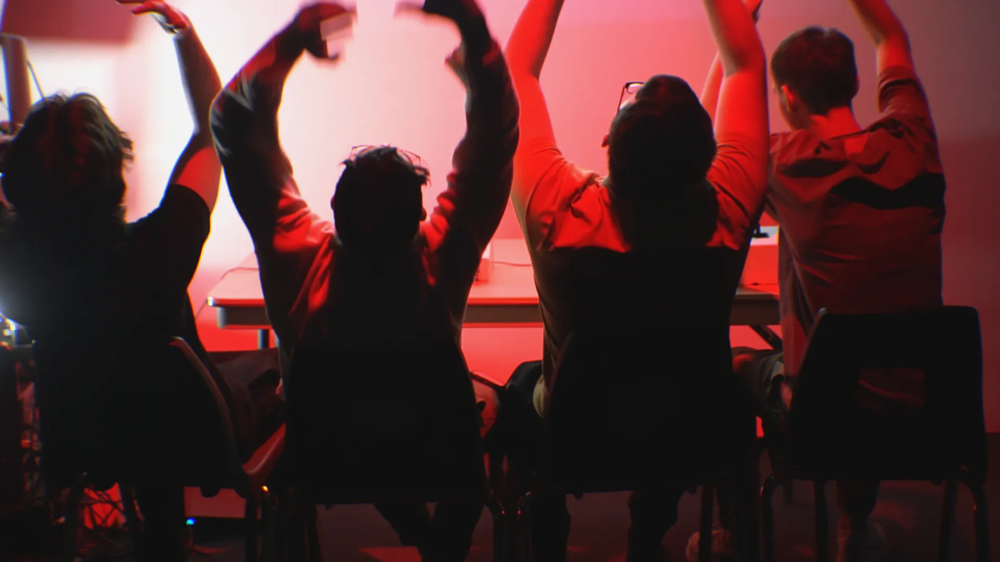

# Terminal
|:pencil2: Information recherchée  | :camera: Appui visuel à intégrer | Détails supplémentaires |
| ---     | ---             | --- |
| No ordre de préférence | |1 |
| Titre du projet ||Terminal |
| Noms des créateurs et créatrices||Émeryk Bélisle, Elie Daher, Ting Yung Lu Terry, Dana Saavedra-Torrano et Mégane Ranger|
| Installation en cours (ou finale)||Il y a 6 poufs pour que les joueurs s'assoient dessus. Devant les joueurs il y a la projection qui montre le jeu terminal. À droite de la projection il y a un code qr qu'il faut scanner pour entrer dans le jeu. |
| Schéma de l'installation prévue| |télécharger le dessin à partir de la documentation GitHub de l'équipe, et indiquer la source dans la légende et le nom du fichier|
| Ce que vous ressentez en expérimentant chacune des installations, avec justification (avant/après l'expérimentation)||Avant: Je ne savais pas vraiment à quoi m'attendre mais j'étais tout de même intéressé à essayer ce jeu collaboratif. Après : J'ai trouvé l'oeuvre intéressante je me suis bien amusé à la joeur avec des amis. C'est un jeu simple, mais très bon. |

En pensant à votre cheminement dans la formation en TIM

  **Indiquer les informations suivantes:**
  
  |:pencil2: Information recherchée  | :camera: Appui visuel à intégrer | Détails supplémentaires |
  | ---     | ---             | --- |
  |  Nommer 3 cours du programme qui vous semblent incontournables pour avoir les compétences pour créer ce genre de projet (voir la [grille de cours du programme](https://www.cmontmorency.qc.ca/programmes/nos-programmes-detudes/techniques/techniques-dintegration-multimedia/grille-de-cours/)) ||Interactivité ludique, Audio et Installation multimédia |
  | Nommer et décrire une technique **ou** une composante technologique qui est utilisée dans l'**un des projets** et que vous ne connaissiez pas. ||Le câble XLR est utilisé pour transmettre l'audio de façon équilibrée. Source : https://soundscapehq.com/fr/quest-ce-quun-cable-xlr/|

# Symbiose
|:pencil2: Information recherchée  | :camera: Appui visuel à intégrer | Détails supplémentaires |
| ---     | ---             | --- |
| No ordre de préférence ||2 |
| Titre du projet ||Symbiose |
| Noms des créateurs et créatrices||Yannick Chamberland, Benjamin Ferland, Ryan Dufault et Walid Cheour. |
| Installation en cours (ou finale)| >Source:https://les-chimistes.github.io/symbiose/#/presse/| |
| Schéma de l'installation prévue| schéma de mise en espace (*plantation* ou *implantation*)|télécharger le dessin à partir de la documentation GitHub de l'équipe, et indiquer la source dans la légende et le nom du fichier|
| Ce que vous ressentez en expérimentant chacune des installations, avec justification (avant/après l'expérimentation)|| |

En pensant à votre cheminement dans la formation en TIM

  **Indiquer les informations suivantes:**
  
  |:pencil2: Information recherchée  | :camera: Appui visuel à intégrer | Détails supplémentaires |
  | ---     | ---             | --- |
  |  Nommer 3 cours du programme qui vous semblent incontournables pour avoir les compétences pour créer ce genre de projet (voir la [grille de cours du programme](https://www.cmontmorency.qc.ca/programmes/nos-programmes-detudes/techniques/techniques-dintegration-multimedia/grille-de-cours/)) || |
  | Nommer et décrire une technique **ou** une composante technologique qui est utilisée dans l'**un des projets** et que vous ne connaissiez pas. |photo ou croquis de la technique ou composante|Indiquer la source de l'information pour cette recherche |
  
