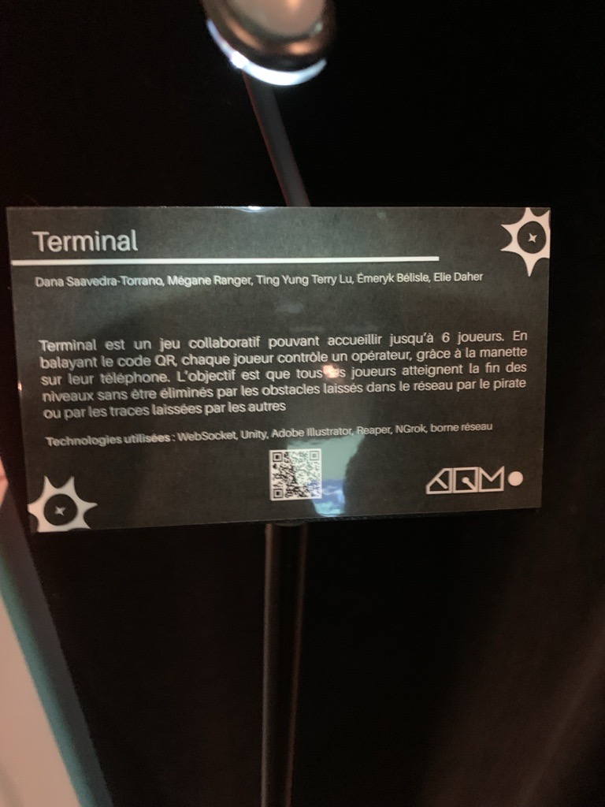

# Réseau Vivant
## Terminal

## Lieu de mise en exposition
Grand Studio

## Type d'exposition
Temporaire

## Date de ma visite
16 mars 2026

## Année de réalisation
2026

## Description du dispositif

  

## Type d'installation
Intéractive

## Fonction du dispositif multimédia
C'est un jeu ou chaque joueur contrôle un personnage qui doit atteindre un objectif. Il y a des obstacles et chaque joueur doit atteindre l'objectif pour avancer dans le prochain niveau. Les joueurs contrôlent leur personnages grâce à leur téléphone. Il suffit de scanner un code QR pour rejoindre la partie.
## Mise en espace

## Composantes et techniques et éléments nécessaires à la mise en exposition
Projecteur, ordinateur, téléphone, pouf, haut-parleurs, lumières, code QR.

## Expérience vécue
Je peux controler la direcion de mon personnage avec mon téléphone et je coopere avec d'autre gens dans le jeu pour gagner la partie.

## Ce qui m'a plu et donné des idées
J'ai aimé l'aspect coopératif du jeu et qu'il ne faut pas juste faire le travail seul.

## Aspect que je ne souhaiterais pas retenire
J'aurais aimé qu'il y aurai plus de varieté dans la niveaux parce que quelques fois le même niveau reccommençait plusieurs fois.

## Références
https://pythons-5.github.io/Terminal/#/
https://tim-montmorency.com/2026/
