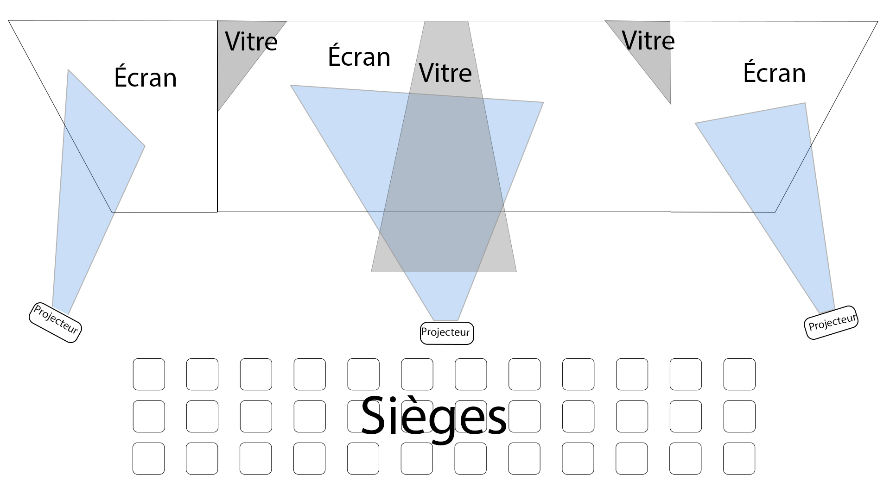
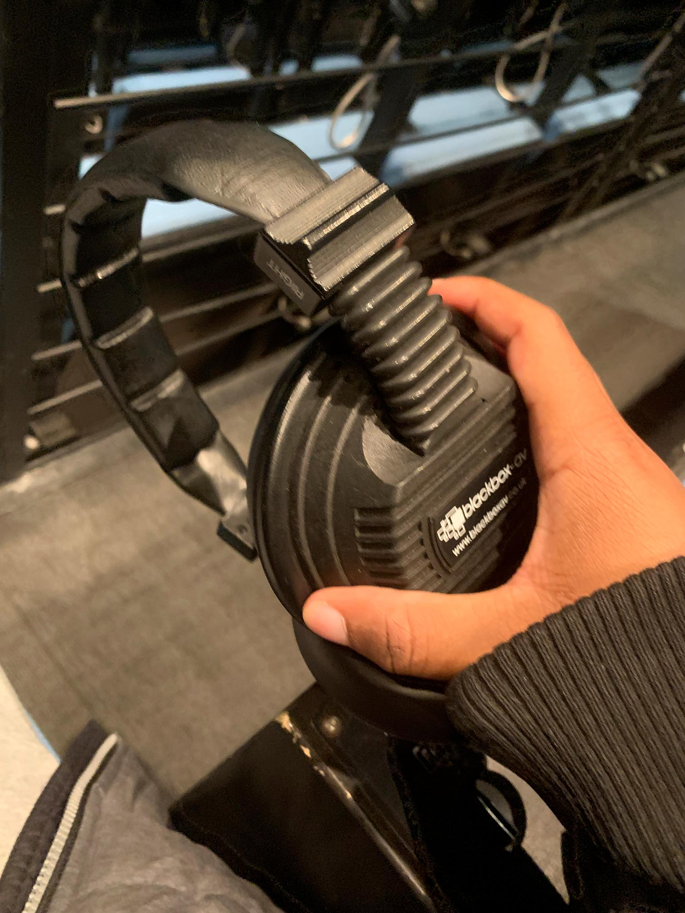
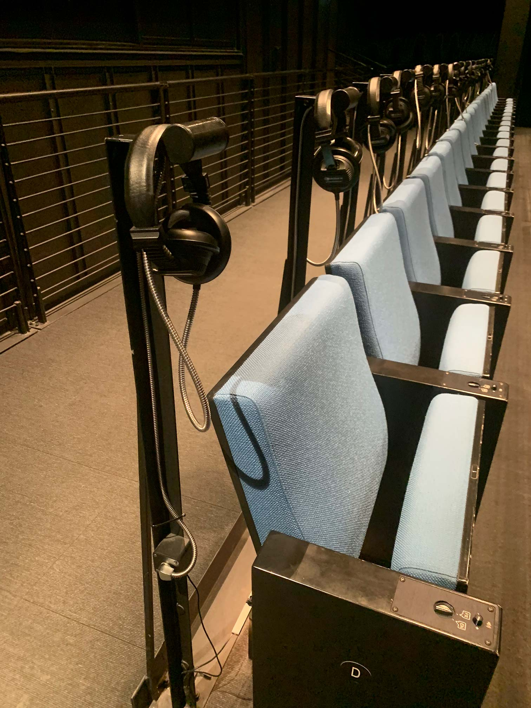
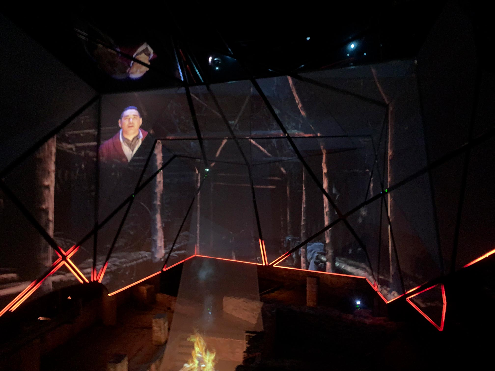

# Pointe-à-Callière
## Spectacle multimédia Générations MTL fait par : TKNL, Studio LEX, El Toro Studio, 20K, et Troublemakers

  
  
  

  >Photo du titre du spectacle multimédia à Pointe-à-Callière - Jayden Louis

  >Vue d'ensemble du spectacle - Jayden Louis

  >Selfie devant l'entrée du musée -Jayden Louis

## Type d'exposition
Permanente et intérieure

## Date de ma visite
20 février 2026

## Année de réalisation
2019

## Description de l'oeuvre ou du dispositif
*Depuis les gradins surplombant d’impressionnants vestiges archéologiques, l’histoire de Montréal revit sous vos yeux ! Projeté sur une installation scénique unique au monde, le spectacle multimédia Générations MTL vous émerveillera tant par ses prouesses technologiques que par sa sensibilité artistique.
Telle une machine à remonter le temps, le spectacle vous entraine au cœur des événements marquants de la ville, à la découverte des gens qui ont contribué à bâtir Montréal. Laissez-vous porter par le récit enchanteur de six personnages qui, fiers héritiers des traditions de leurs ancêtres, vous raconteront leur Montréal et ce qui en fait une métropole aussi unique.
Vibrez au rythme de ce spectaculaire récit de 17 minutes mettant à profit des moyens technologiques qui font la réputation de Montréal.
Jamais l’histoire n’aura été si vivante !*
- Source dans le site de l'exposition: https://pacmusee.qc.ca/fr/expositions/detail/spectacle-multimedia-generations-mtl/

## Type d'installation
Contemplative et immersive

## Croquis

> Croquis de l'exposition -Jayden Louis
  

## Composantes et techniques et éléments nécéssaires
Les projecteurs, les casques d'écoute, les sièges, l'ajusteur de volume, le changeur de langue et les lumières led.

> Photo du casque d'écoute utilisé pour entendre le spectacle -Jayden Louis

> Photo des sièges -Jayden Louis

## Expérience vécue
J’étais dans une pièce semblable à une salle de cinéma. Il y avait plusieurs sièges sur lesquels on pouvait s’asseoir. À droite des sièges, on trouvait des casques stéréo. Il fallait en mettre un pour entendre le son de l’œuvre. Il était aussi possible de changer la langue de l’audio, soit en anglais soit en français. Devant moi, il y avait plusieurs écrans divisés, ainsi que trois autres écrans faits de verre. Il y avait aussi trois écrans en verre sur lesquels l’image apparaissait grâce à un système de projection et de reflet. De plus, sur les bords des écrans, des lumières se déplaçaient et clignotaient comme des LED. Le spectacle racontait l’histoire de Montréal en général. Il commençait au XVIe siècle et se terminait à notre époque.

> Photo prise pendant le spectacle -Jayden Louis

## Ce qui m'a plu
J’ai aimé que des écouteurs soient fournis, car cela offre une expérience différente de celle des cinémas traditionnels. J’ai aussi apprécié les écrans scindés, parce qu’ils permettaient de montrer différentes images en même temps sans que ce soit trop forcé.

## Ce que je changerais ou améliorerais
Je ferais en sorte que les chaises bougent pendant l’exposition, un peu comme les sièges D-BOX au cinéma, qui vibrent selon ce qui se passe à l’écran. Je changerais aussi les casques fournis, car à mon avis ils ne sont pas très confortables et leur qualité n’est pas très bonne.

## Sites web des studios qui ont créé ce spectacle
- https://www.eltorostudio.com/generations-mtl/
- https://www.tknl.com/projet-experiences/generations-mtl-pointe-a-calliere-cite-archeologie-d-histoire
- http://lexstudio.ca/
- https://20k.ca/en/projects/musee-pointe-a-calliere/
- https://troublemakers.ca/generations-mtl-fr/

