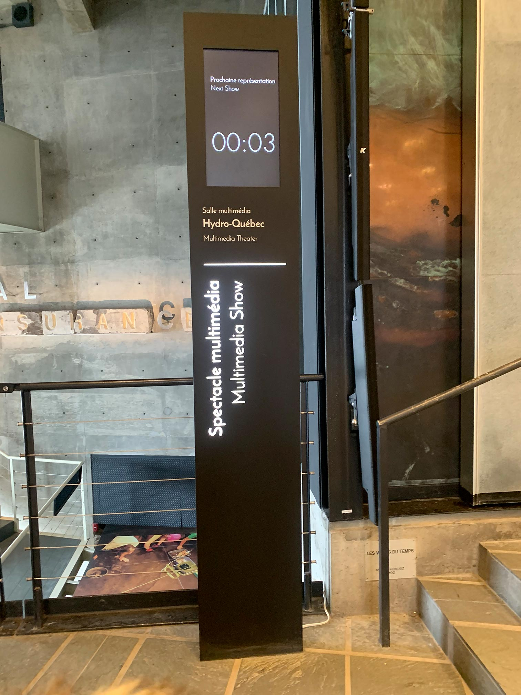
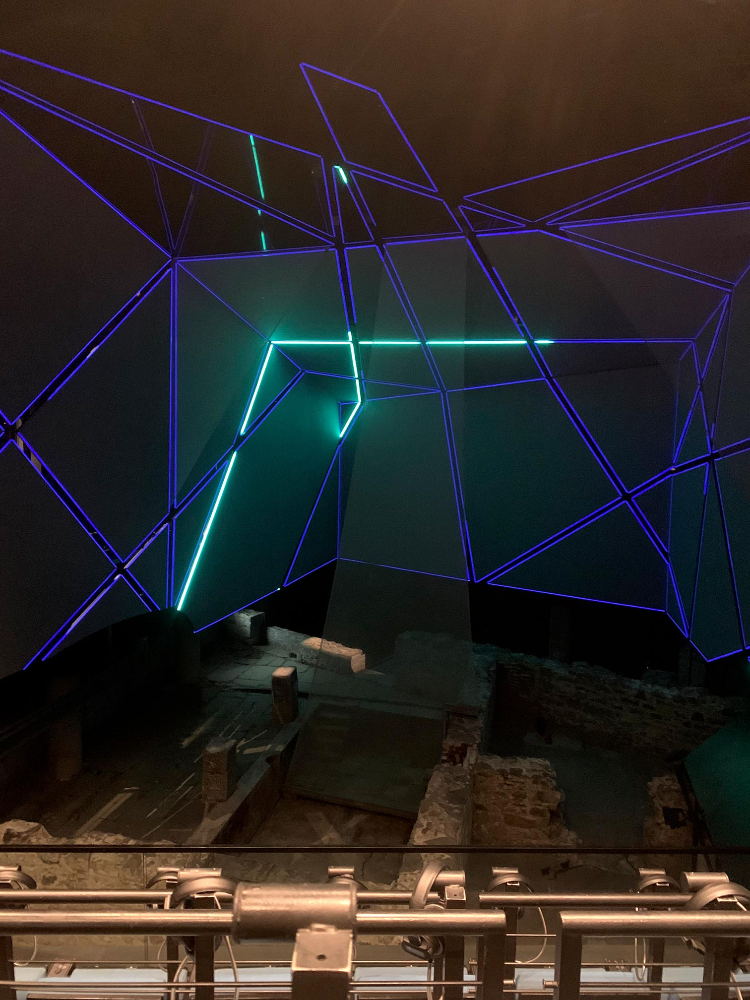

# Spectacle multimédia Générations MTL fait par : TKNL, Studio LEX, El Toro Studio, 20K, et Troublemakers

## Lieu de mise exposition
Pointe-à-Callière

## Type d'exposition
Permanente et intérieure

## Date de ma visite
20 février 2026

## Année de réalisation
2019

## Description de l'oeuvre ou du dispositif
*Depuis les gradins surplombant d’impressionnants vestiges archéologiques, l’histoire de Montréal revit sous vos yeux ! Projeté sur une installation scénique unique au monde, le spectacle multimédia Générations MTL vous émerveillera tant par ses prouesses technologiques que par sa sensibilité artistique.
Telle une machine à remonter le temps, le spectacle vous entraine au cœur des événements marquants de la ville, à la découverte des gens qui ont contribué à bâtir Montréal. Laissez-vous porter par le récit enchanteur de six personnages qui, fiers héritiers des traditions de leurs ancêtres, vous raconteront leur Montréal et ce qui en fait une métropole aussi unique.
Vibrez au rythme de ce spectaculaire récit de 17 minutes mettant à profit des moyens technologiques qui font la réputation de Montréal.
Jamais l’histoire n’aura été si vivante !* -Site de l'exposition: https://pacmusee.qc.ca/fr/expositions/detail/spectacle-multimedia-generations-mtl/

## Type d'installation
Contemplative et immersive

## Croquis

## Composantes et techniques et éléments nécéssaires
Les projecteurs, les casques d'écoute et les lumières led.

## Expérience vécue
J'étais dans une pièce similaire à celle d'un cinéma. Il y avait plusieurs siège dont on povait s'assir dessus. Sur la droite des sièges, il y a des casques stéréo. Il faut mettre un casque pour entendre le son de l'ouevre. Il était aussi possible de changer la langue de l'audio pour anglais ou français. Devant moi, il y avait plusieurs écrans scindés et il y avait aussi 3 autres écrans fait de vitre. Ces écrans là sont projeté grâce au reflet d'une vidéo. De plus, sur le bord des écrans il y avait des lumières qui se déplacaient et clignotaient comme des led. Le spectacle parlait de l'histoire de Montréal en général. Ça commencait par le 16e siècle et ça a fini à notre époque.

## Ce qui m'a plu
J'ai aimé que des écouteurs soit fourni, car ça rend une expérience différente qu'aux cinémas traditionnels. J'ai aussi aimé les écrans scindés, car cela donnait l'opportunité de montrer différentes images en même temps sans que ça soit trop forcé.

## Ce que je changerais ou améliorerais
Je ferais que les chaises bougent pendant l'exposition. Similaire au D-BOX au cinéma quand les chaises vibres selon ce qui a devant l'écran. Je changerais aussi les casques qu'ils fournissent. À mon avis, ils ne sont pas très confortable et leur qualité n'est pas très bonne.

